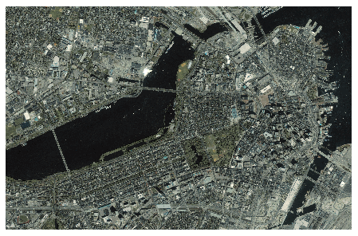

# Working with "Geotiff" or tif files

There are lots of programs and python modules that reads .tif files, but we will be talking about a python module **Rasterio**

### Installing Rasterio

Installing **Rasterio** is a bit tricky, but it is always recommended to create a [virtual environment](https://docs.python.org/3/tutorial/venv.html) when working on any new python project.

virtualenv Installing guide For pycharm users: [click](https://www.jetbrains.com/help/pycharm/creating-virtual-environment.html)

virtualenv installing guide for Anaconda: [click](https://wiki.math.ntnu.no/_media/anaconda/navigator-create-environment.png)

**Recommended way of installing this package**

conda install rasterio -c conda-forge

# Basic topics: [Here](https://rasterio.readthedocs.io/en/latest/quickstart.html)

# Advanced topics: [Here](https://rasterio.readthedocs.io/en/latest/topics/index.html#)

### To get started, click [here](https://github.com/Idreesqbal/GeoTif3DPlot/blob/master/GeoTif3DModel.ipynb)
